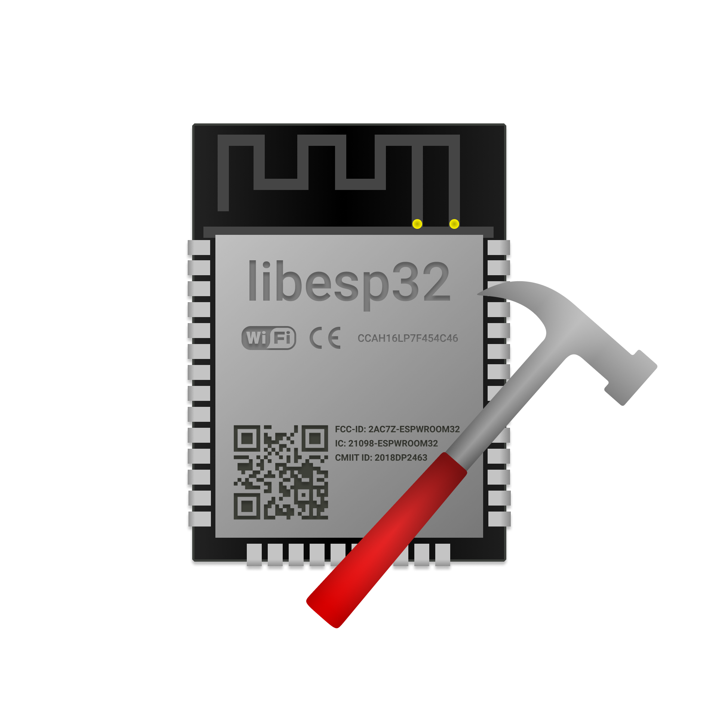

# libesp32

A collection of C libraries for ESP32 programming with ESP-IDF framework.

    

## SSD1306 Display Bring-up

### Libraries
Using PlatformIO and ESP-IDF we can use lexus2k/ssd1306 library to talk to the display.

Since it's a ESP-IDF component we must create a folder in project's root directory named
`components` and clone/submodule lib's repository there.

To build and link against it you should set `COMPONENT_DIR` variable in your root's CMakeLists.txt
using this directive: `set(COMPONENT_DIR components)`.

### Use hardware I2C in custom configuration
lexus2k/ssd1306 uses a default I2C controller with its default pins, to configure your own
you must call `ssd1306_platform_i2cInit` defined in header `ssd1306_hal/io.h`. The right functions
for your platform are automagically loaded by the preprocessor.

Examples are located in /examples directory.